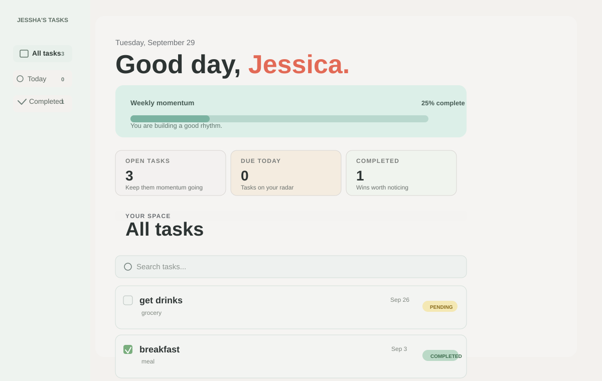
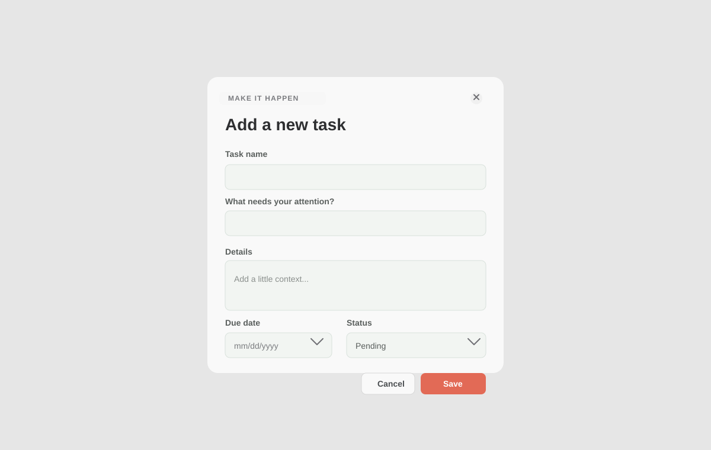

# Personal Task Manager

**Project Code:** WST21-PM-2026-SF  
**Student Name:** Jessha Caballero  
**Course & Year:** BSIT - 2nd Year  
**Database Used:** SQLite

## Features

- Add Task
- View Tasks
- Edit Task
- Delete Task
- Update Status

## Technologies Used

- Laravel
- Routes
- Controller
- Model
- Blade Views
- SQLite Database

## How It Works

1. Route (`routes/web.php`) receives the request and sends it to the `TaskController`.
2. Controller (`app/Http/Controllers/TaskController.php`) handles the logic — fetching, creating, updating, and deleting tasks.
3. Model (`app/Models/Task.php`) connects to the `tasks` table in the database.
4. Blade Views (`resources/views`) display the task list, add form, and edit form to the user.

## Screenshots

  

  

